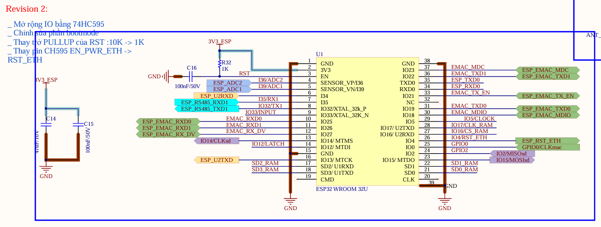
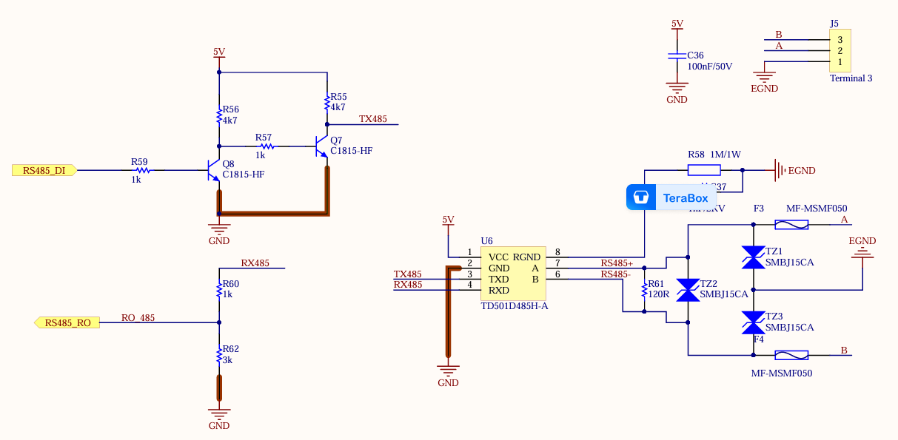

# Reading rt1(rooftop sensor) of Kipp&Zonen via modbus RTU

- This tiny project will read temperature, radiation sensor.

### Hardware Required

1. Belink-V2 board, UART(tx I/O 32, rx I/O 35,) -> Modbus module TD501D485H -> radiation Sensor

#### RS485 example connection circuit schematic:





#### Setup :

1. Set modbus slave ID : modbus_set_slave(ctx, 99); // modbus ID , default = 1;

2. UART : Pay attention at functions: esp_vfs_dev_uart_set_rx_line_endings , esp_vfs_dev_uart_set_tx_line_endings

Reference : https://docs.espressif.com/projects/esp-idf/en/stable/esp32/api-reference/storage/vfs.html#

3. Sensor document : https://www.kippzonen.com/Download/947/Manual-RT1-Rooftop-Monitoring-System-BY

4. Application to read sensor : https://www.kippzonen.com/Download/1101/Smart-Explorer-installer-SX-2-2-2-29916

## Example Output

Example output of the application:

```
I (420450) RS485_ECHO_APP: Modbus data received:
Device Type: 631
Data Model Version: 103
Operational Mode: 8
Sensor Data (Sensor 1): 0
Panel Temperature: 24.7°C
External Power Voltage: 10.3V
Calibration Date: 00/00/00
[63][04][00][00][00][0A][78][4F]
Waiting for a confirmation...
<63><04><14><02><77><00><67><00><01><00><08><00><00><00><00><00><00><00><00><00><F7><00><64><C0><F1>
I (421510) RS485_ECHO_APP: Modbus data received:
Device Type: 631
Data Model Version: 103
Operational Mode: 8
Sensor Data (Sensor 1): 0
Panel Temperature: 24.7°C
External Power Voltage: 10.0V
Calibration Date: 00/00/00
[63][04][00][00][00][0A][78][4F]
Waiting for a confirmation...
<63><04><14><02><77><00><67><00><01><00><08><00><00><00><00><00><00><00><00><00><F7><00><6A><41><35>
```

The received message is showed in hexadecimal form in the brackets.

## Troubleshooting

When example software does not show the `.` symbol, the issue is most likely related to connection errors of the external RS485 interface.
Check the RS485 interface connection with the environment according to schematic above and restart the application.
Then start terminal software and open the appropriate serial port.
